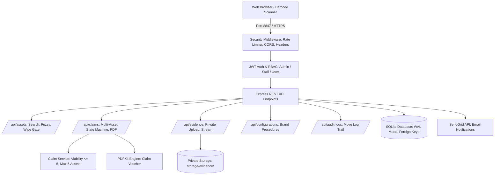
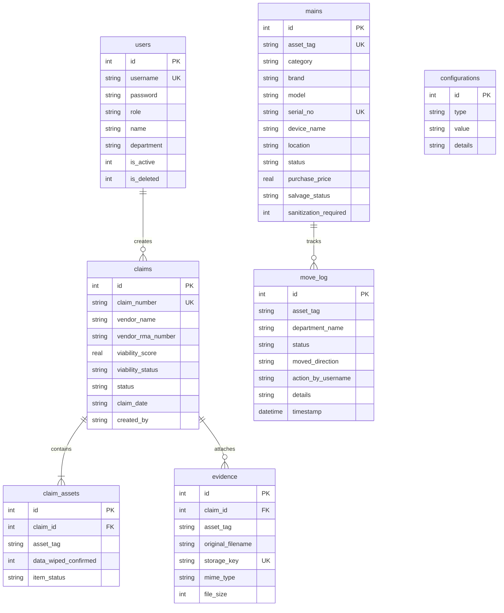

# ClaimIT 🛡️
**ระบบติดตามรับประกันและส่งเคลมครุภัณฑ์ไอทีโรงพยาบาล**  
*Hospital IT Warranty & RMA Claim Management System*

---

## 📌 ภาพรวมระบบ (Overview)
**ClaimIT** เป็นระบบบริหารจัดการการรับประกันและกระบวนการส่งเคลมครุภัณฑ์ไอที (RMA) สำหรับโรงพยาบาล ออกแบบเพื่อตอบสนองการทำงานจริงของฝ่าย IT Support:
- ควบคุมความปลอดภัยของข้อมูลผู้ป่วย (PDPA-Aware Handling)
- ประเมินความคุ้มค่าของการส่งซ่อมด้วยคะแนนความคุ้มค่า (Server-Authoritative Viability Score)
- จัดการใบส่งเคลมแบบหลายครุภัณฑ์ (Multi-Asset Claim: สูงสุด 5 รายการต่อใบเคลม)
- แนบและจัดเก็บไฟล์หลักฐานภาพถ่าย/เอกสารใน Private Storage พร้อมระบบป้องกัน IDOR
- บันทึกประวัติการเคลื่อนย้ายและสถานะครุภัณฑ์แบบถาวร (Immutable Audit Logging)

---

## 🏗️ แผนภาพสถาปัตยกรรมระบบ (System Architecture)



---

## 🗄️ แผนภาพฐานข้อมูล (Entity-Relationship Diagram)



---

## ✨ คุณสมบัติเด่น (Key Features)

1. 🔐 **Standalone Authentication & RBAC:**
   - ใช้ JWT แท้ (Sign ด้วย `JWT_SECRET` ที่ปลอดภัย ไม่ใช้ Hardcoded Fallback)
   - เข้ารหัสรหัสผ่านด้วย `bcryptjs` (Cost factor 10)
   - ป้องกัน User ถูกปิดการใช้งาน (`is_active = 0`) เข้าถึงระบบ
2. 🛡️ **PDPA-Aware Storage Sanitization Safeguard:**
   - บังคับให้ล้างข้อมูลหรือถอดฮาร์ดไดร์ฟก่อนส่งเคลม
   - ต้องกรอกรหัสยืนยันความปลอดภัย (`WIPED` หรือรหัสครุภัณฑ์) ก่อนบันทึกการล้างข้อมูล
3. 📦 **Multi-Asset Claims (1–5 Assets per Claim):**
   - รองรับการรวมครุภัณฑ์สูงสุด 5 ชิ้นต่อ 1 ใบเคลม (ชิ้นที่ 6 ขึ้นไปจะถูกปฏิเสธโดย Backend)
   - จัดการใน Atomic SQLite Transaction เดียวกัน
4. 📊 **Server-Authoritative Viability Score:**
   - Backend คำนวณความคุ้มค่าโดยอัตโนมัติ: `Score <= 5.0` = `VIABLE` (คุ้มค่า), `Score > 5.0` = `NOT_VIABLE`
5. 📂 **Private Evidence Storage & IDOR Protection:**
   - จัดเก็บไฟล์หลักฐานนอก Public Web Root ด้วยรหัส UUID
   - ตรวจสอบสิทธิ์ก่อนเปิดดูไฟล์ ป้องกันการเข้าถึงโดยไม่ได้รับอนุญาต
6. 📜 **Immutable Audit Trail:**
   - บันทึกทุกเหตุการณ์การเคลื่อนย้าย เปลี่ยนแปลงสถานะ และการเข้าสู่ระบบ

---

## 🚀 การติดตั้งและเริ่มใช้งาน (Quick Start)

### วิธีที่ 1: ติดตั้งแบบปกติ (Node.js)

```bat
REM 1. ติดตั้ง Dependencies
npm install

REM 2. คัดลอก Environment Variables
copy .env.example .env

REM 3. เริ่มระบบ (เปิดที่ http://localhost:8847)
npm start
```

### วิธีที่ 2: รันผ่าน Docker Compose

```bash
# รันผ่าน Docker
docker compose up -d

# ดู Log การทำงาน
docker compose logs -f
```

---

## 🔑 ข้อมูลผู้ใช้งานสำหรับทดสอบ (Demo Credentials)

> [!NOTE]
> รหัสผ่านด้านล่างนี้ใช้สำหรับสภาพแวดล้อมการพัฒนา/ทดสอบเท่านั้น (DEMO ONLY)

| Role | Username | Password | สิทธิ์การใช้งาน |
|---|---|---|---|
| **Admin (IT Head)** | `admin` | `admin123` | จัดการผู้ใช้, จัดการแผนก, อัปเดตการตั้งค่าระบบ, อนุมัติและดูแลระบบทั้งหมด |
| **General Staff (Ward & IT)** | `staff` | `staff123` | สแกนแจ้งชำรุดหอผู้ป่วย (Ward Portal), สแกนรับของ, ล้างข้อมูล PDPA, สร้างใบส่งเคลม (RMA), แนบหลักฐาน |

---

## 🧪 การทดสอบระบบอัตโนมัติ (Automated Testing)

ระบบมีชุดทดสอบครอบคลุมทุกกฎความปลอดภัยและ Business Rules:

```bash
# 1. รันชุดทดสอบหลัก 10 ขั้นตอน (Auth, RBAC, Viability, Max 5 Assets, Evidence, Wipe Code, Health)
node test_suite.js

# 2. รันชุดทดสอบกระบวนการทำงานครบวงจร (Integration Workflow)
node test_workflow.js
```

---

## ⚙️ การตั้งค่า Environment Variables

| Variable | จำเป็น | ค่าเริ่มต้น | คำอธิบาย |
|---|---|---|---|
| `PORT` | ไม่ | `8847` | พอร์ตที่ Web Server ให้บริการ |
| `JWT_SECRET` | **ใช่** | - | Secret Key สำหรับ Sign JWT Token (ต้องไม่เว้นว่างใน Production) |
| `NODE_ENV` | ไม่ | `development` | สภาพแวดล้อมการทำงาน (`development` / `production` / `test`) |
| `SENDGRID_API_KEY` | ไม่ | - | API Key ของ SendGrid สำหรับส่งอีเมลแจ้งเตือนจริง |
| `SENDGRID_FROM` | ไม่ | `no-reply@claimit.local` | อีเมลผู้ส่ง |