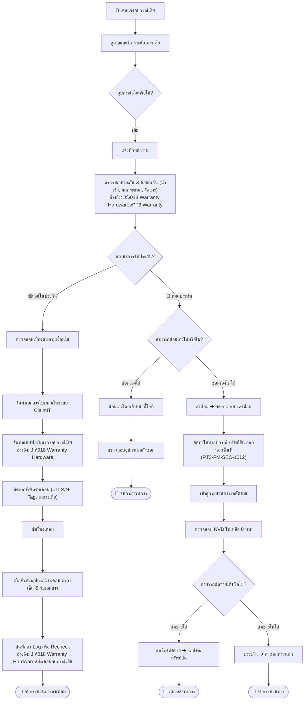

# 📑 21. แบบฟอร์มทางการ 2 ฉบับ และผังขั้นตอนการเคลม (Phyathai 3 Hospital Official Forms & Claim Workflow SOP)

เอกสารบทนี้อธิบายรายละเอียดเกี่ยวกับ **2 แบบฟอร์มหลักทางการของโรงพยาบาลพญาไท 3** ที่ใช้ในการปฏิบัติงานจริง, **ระบบตรวจสอบประกันศูนย์ Acer**, **ผังขั้นตอนการรับแจ้งอุปกรณ์เสียและส่งเคลม (Claim Workflow SOP)**, และ **ความสามารถในการรองรับการขยายตัว (Scalability)**

---

## 1. 🌐 การเชื่อมต่อระบบตรวจสอบประกันศูนย์ Acer (Official Acer Warranty)

- **Official Warranty Link:** [https://register.acer.co.th/Warranty Check/warr_chk.aspx](https://register.acer.co.th/Warranty%20Check/warr_chk.aspx)
- **ขั้นตอน SOP ประจำโรงพยาบาล:**
  1. เข้าสู่ระบบตรวจสอบประกันศูนย์ Acer ผ่านลิงก์ทางการ
  2. ตรวจสอบเงื่อนไขการรับประกันเบื้องต้น (ไม่อยู่ในข้อยกเว้น: น้ำเข้า, ตกกระแทก, งัดแงะ) จากแฟ้ม `J:\018 Warranty Hardware\PT3 Warranty`
  3. แจ้งเคลมไปที่ `acerthai@acer.com` หรือ Call Center `02-153-9600`
  4. หากเป็นการเคลมอุปกรณ์ต่อพ่วง (เมาส์ / คีย์บอร์ด / Adapter) **ต้องระบุหมายเลข S/N ของเครื่อง PC/AIO ตัวแม่เสมอ**
  5. จัดทำ **แบบฟอร์มตรวจอุปกรณ์เสีย** สำหรับผู้รับเคสและผู้ตรวจสอบ
  6. เมื่อช่างนำอุปกรณ์มาเคลม ตรวจเช็ค รับเอกสารเคลม และบันทึกลง Log `J:\018 Warranty Hardware\ส่งเคลมอุปกรณ์เสีย`
- **จุดเข้าถึงด่วนในระบบ:**
  - ปุ่ม `[ 🌐 ตรวจสอบรับประกัน Acer ]` และ `[ 📋 คัดลอก S/N ]` บนการ์ดรายละเอียดครุภัณฑ์
  - แถบข้างข้อมูลด่วน (Quick Sidebar) หัวข้อ Hotlines
  - ภายในหน้าต่างผังขั้นตอนการเคลม (Claim Workflow SOP)

---

## 2. 🧭 ผังขั้นตอนการรับแจ้งอุปกรณ์เสียและส่งเคลม (Claim Workflow SOP)

ระบบจัดเตรียมหน้าต่างผังขั้นตอนการทำงาน (เปิดได้จากปุ่ม Header `🧭 ผังขั้นตอนการเคลม (SOP)` และ Sidebar):

---

## 3. 📑 2 แบบฟอร์มทางการที่ระบบรองรับโดยเฉพาะ (Strictly 2 Hospital Forms)

ระบบตัดเทมเพลตที่ไม่เกี่ยวข้องออกทั้งหมด และเหลือเฉพาะ 2 แบบฟอร์มหลักของโรงพยาบาลพญาไท 3:

### แบบฟอร์มที่ 1: "ใบตรวจเช็คอุปกรณ์ เสีย" (Defective Equipment Inspection Form)
- **หัวเอกสาร:** โลโก้เครือโรงพยาบาลพญาไท 3 พร้อมข้อความ "พญาไท 3 PHYATHAI 3 เพชรเกษม 19"
- **รายละเอียดครุภัณฑ์:** ประเภทอุปกรณ์, ผู้เก็บอุปกรณ์ (สีแดง), Tag / Serial, แผนก, ชั้น
- **สถานะอุปกรณ์:** `[ ] ใช้งานได้ หมายเหตุ ( ถ้ามี )` (สีแดง) / `[X] เสีย อาการเสีย`
- **สถานะดำเนินการต่อ:** `[ ] ส่งเครม`, `[ ] ส่งซ่อม*มีค่าใช่จ่าย` (สีแดง), `[ ] สั่งซื้อทดแทน`, `[ ] ตัดขาย`, `[ ] เก็บเข้า Stock`
- **3 กล่องลงนามด้านล่าง:**
  1. ผู้ตรวจสอบอุปกรณ์
  2. ผู้ดำเนินการต่อ
  3. เฉพาะกรณีส่งเครม , ส่งซ่อม (สีแดง: วันที่ส่งเครม / ส่งซ่อม, ชื่อ บริษัท, ลงชื่อผู้ส่งอุปกรณ์)

### แบบฟอร์มที่ 2: "ใบนําอุปกรณ์ ทรัพย์สิน ออกนอกพื้นที่" (PT3-FM-SEC-1012)
- **หัวเอกสาร:** `PHYATHAI 3 HOSPITAL โรงพยาบาลพญาไท 3 PETCHKASEM 19 • เพชรเกษม 19` พร้อมรหัสควบคุม `PT3-FM-SEC-1012`
- **ข้อมูลผู้ขออนุญาต:** ชื่อ-สกุล, ตำแหน่ง, แผนก/หน่วย
- **การนำออก:** `[X] โรงพยาบาลออก`, `[X] อนุญาตให้ ชื่อ/บริษัท ... เป็นตัวแทนนำออก`
- **ตาราง 10 แถวบริบูรณ์:** ลำดับ 1–10, รายการ (ยี่ห้อ/รุ่น/SN), จำนวน, หมายเหตุ Tag
- **เหตุผลการนำออก:** เพื่อซ่อม, จำหน่าย, ใช้งานภายนอกโรงพยาบาล, ยืมระหว่างโรงพยาบาล, ย้ายออกจากหอพัก, อื่นๆ
- **ยานพาหนะ:** ทะเบียน, สี, ยี่ห้อ, วัน-เวลานำออก
- **5 ลายเซ็นอนุมัติ:** เจ้าของทรัพย์สิน, ผู้จัดการแผนก/หัวหน้าหน่วย, ผู้อำนวยการโรงพยาบาล/ฝ่าย, รปภ.จุดทางออก, หน่วยรักษาความปลอดภัย
- **หมายเหตุควบคุมเอกสาร:** `PT3-FM-SEC-1012; แก้ไขครั้งที่ 07; วันที่มีผลบังคับใช้ 01/12/2563; หน้า 1 / 1`

---

## 4. ⚡ การอำนวยความสะดวกในชีวิตจริง (Zero-Friction Workflow)

1. **ปุ่ม 1-Click บนหน้าต่างครุภัณฑ์:**
   - `[ 📑 ใบตรวจเช็คเสีย (Form 1) ]` ➔ เปิดแบบฟอร์ม 1 พร้อมกรอกข้อมูลครบ 100% ทันที
   - `[ 🚪 ใบนําออก (PT3-FM-SEC-1012) ]` ➔ เปิดแบบฟอร์ม 2 พร้อมกรอกข้อมูลครบ 100% ทันที
2. **ปุ่มคัดลอก S/N และ Tag ด่วน:**
   - มีปุ่ม `[ 📋 คัดลอก S/N ]` และ `[ 📋 คัดลอก ]` อยู่ข้างช่องข้อมูล สามารถคลิกเพื่อก๊อปปี้ไปวางในเว็บไซต์ประกันหรือเมลแจ้งเคลมได้ทันที
3. **การออกใบ Gate Pass รวมชุด (Batch Multi-Asset Gate Pass):**
   - ในหน้าต่างรายละเอียดใบส่งเคลม (Claim Details Modal) มีปุ่ม `[ 🚪 พิมพ์ใบนําออกรวม (PT3-FM-SEC-1012) ]` ที่ดึงเครื่องทุกชิ้นในชุด (1 ถึง 5 เครื่อง) มาใส่ในแถวที่ 1 ถึง 5 ของตาราง 10 แถวในหน้าเดียวทันที

---

## 5. 🚀 สถาปัตยกรรมรองรับการขยายตัว (Enterprise Scalability)

ระบบเพิ่มดัชนี (Database Indexes) ครอบคลุมทุกคอลัมน์ที่มีการสืบค้น คัดกรอง และประมวลผล เพื่อให้ระบบทำงานได้รวดเร็วระดับ Sub-millisecond แม้ข้อมูลครุภัณฑ์จะมีมากกว่า 50,000 รายการ:
- `idx_mains_asset_tag`, `idx_mains_serial_no`
- `idx_mains_status_deleted`, `idx_mains_location_deleted`
- `idx_mains_brand_category`, `idx_mains_warranty_end`
- `idx_claims_claim_number`, `idx_claims_status_deleted`, `idx_claims_created_at`
- `idx_claim_assets_claim_id`, `idx_claim_assets_asset_tag`
- `idx_evidence_storage_key`, `idx_configurations_type`
- `idx_move_log_asset_tag`, `idx_move_log_timestamp`
